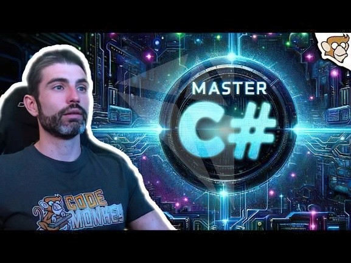
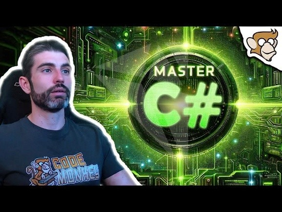
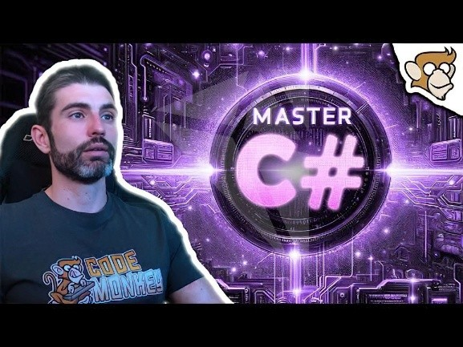
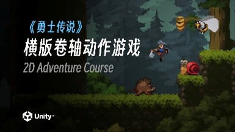
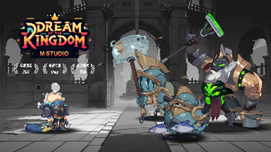
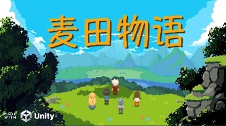

=============================
程序培养方案
=============================

.. note::
   最后更新：2025年9月7日

----------------
引言
----------------

出色的游戏开发程序员不仅熟练引擎，更是将计算机科学基础内化于心。因此，我们的培养方案除了教会你引擎之外，还将帮助你构建一个 **可迁移** 的知识体系：

1. **计算机科学基础** ：数据结构与算法、计算机操作系统、计算机网络、计算机组成原理、设计模式。其中，对于游戏开发最重要的是： **数据结构与算法** 、 **计算机网络** 、 **设计模式** 。见友情链接： `DgutCsWiki <https://www.dgutcs.wiki/>`_ 。

2. **游戏开发** ：引擎、架构、性能与内存优化、工具开发、图形学等。

.. admonition:: 核心理念

   我们强烈反对脱离实际应用的枯燥理论，也鄙视没有理论支撑的脆弱实现，换句话说，学东西就是为了写项目，写项目就是为了学东西！

----------------
阶段概述
----------------

+--------+--------------------------------------------------+------------+----------------------------------------------------+
| 阶段   | 目标                                             | 预计时长   | 目标完成的参考标准                                 |
+========+==================================================+============+====================================================+
| 1      | 掌握C# 初级/中级语法 +                           | 1-3个月    | 通过基础考核                                       |
|        | 数据结构与算法                                   |            |                                                    |
+--------+--------------------------------------------------+------------+----------------------------------------------------+
| 2      | 掌握C# 高级语法 + Gameplay实战                   | 1-3个月    | 通过中级考核                                       |
+--------+--------------------------------------------------+------------+----------------------------------------------------+
| 3      | 练习向独立游戏（通常为2D）+                      | 2-4个月    | 体验该项目的完整开发                               |
|        | 架构/性能与内存优化 +                            |            |                                                    |
|        | (图形学与Shader，可选)                           |            |                                                    |
+--------+--------------------------------------------------+------------+----------------------------------------------------+
| 4      | 练习向商业项目（通常为3D）+                      | 3-5个月    | 体验该项目的完整开发                               |
|        | 架构/性能与内存优化 +                            |            |                                                    |
|        | (图形学与Shader，可选)                           |            |                                                    |
+--------+--------------------------------------------------+------------+----------------------------------------------------+
| 5      | (兴趣向项目，可选且建议选) +                     | 循环       | 第一份实习（恭喜你，你不再是本方案的受用者了！）   |
|        | (工具开发，可选且建议选) +                       |            |                                                    |
|        | 图形学与Shader                                   |            |                                                    |
+--------+--------------------------------------------------+------------+----------------------------------------------------+

.. note::
   阶段3/4将2D归为独立游戏，3D归为商业项目是一种简单粗暴但有理有据（比如实现难度等）的分类模式。但切记，现实中当然存在大量成功的3D独立游戏和2D商业项目，请勿因此产生歧义。

.. admonition:: 关于引擎选择 (Unity)
   :class: topic

   注：本方案使用的引擎均为Unity，主要原因在于：

   1. Unity的学习难度相对于Unreal来说更低（其中有一部分原因是因为Unreal的脚本语言是C++）。
   2. `2025年上半年中国游戏行业报告分析 <https://www.bilibili.com/video/BV1KstZz8EVT>`_ 中，Unity的使用情况依旧位居第一。
   3. 团队目前还没有能够进行教学工作的Unreal开发者。如果自己的职业规划中选择了Unreal，请比对本方案自行学习！ **（期待你成为能够进行教学工作的Unreal开发者）**

----------------
其他
----------------

1.  直接投入项目学习，遇到不懂的再搜索、提问，获得一定的学习体验之后，再进行结构化的知识体系学习（先上车，再买票((()))）。本人在团队中进行Code Review时，发现各项目组的同学语法基础非常薄弱，讲解概念时一头雾水——这其实并不是说明同学们没有认真观看教程视频，反而说明了同学们太“认真”观看教程视频，忽略了项目学习，请各位初学者学习完C# 初级/中级 + 数据结构与算法之后，尽快投入到Gameplay实战中！

2.  学会问问题！！！学长学姐当然乐意回答问题，但他们也不是保姆哦~！

3.  IDE推荐使用Rider（对于个人开发者来说免费），但是，在阶段1的C# 初级/中级与阶段2的C# 高级语法教程视频中，使用的是Visual Studio。虽然无论对于哪一个IDE来说，C# 语法都没有区别，但是，说真的：从Visual Studio转到Rider，真的感觉发现了新世界，coding体验非常丝滑，所以推荐使用Rider！！！

4.  技术固然重要，但掌握软技能（主观能动性/成长型思维等）能让你走得更远，推荐阅读《队伍成长指南》。

--------------------------------
阶段1
--------------------------------

本阶段旨在掌握面向对象的开发思维，学习数据结构与算法，为下阶段进入简单Gameplay实战夯实基础。

.. tip::

   **Q：可以与C语言教程一起看吗？**

   A：当然可以，特别是当你看不懂本教程时，说明它对于你来说是Next Level，所以先去看C语言教程吧~！

   **Q：你不是说先上车，再买票吗？为什么这里要先看教程视频？**

   A：这里需要特别说明一下，进入一个新领域，拥有一定的基础知识非常重要。

   1. **“先上车”** ：指的是 **直接开始动手做一个具体的、你感兴趣的项目** 。哪怕这个项目只是一个很小的Demo。这个动作的目的是：
      
      * **建立 context (上下文/应用场景)** ：让你立刻知道你所学的知识 **用在哪里** 、 **有什么用** 。比如，当你需要让角色移动时，你才会真正去理解Input/Transfrom/Rigidbody等。
      * **获得即时反馈和成就感** ：看到一个能跑能玩的东西，是维持学习热情最强的燃料。
      * **暴露知识盲区** ：你会遇到无数个“这个功能该怎么实现？”的问题，这会让你接下来的学习变得 **极具针对性** 。

   2. **“再买票”** ：指的是在项目遇到瓶颈时， **带着具体问题，回头进行有目的的、系统性的补课** 。这个过程是：

      * **目标驱动** ：你不是在漫无目的地看书/看教程视频，而是在为解决“如何让我的背包系统更高效？”而去学习数据结构。
      * **理论联系实际** ：这时你再看教程，会发现以前枯燥的概念突然变得鲜活起来。你会惊呼：“原来这个技术就是用来解决我那个问题的！”(((

   **这就是为什么不能“无票上车”（即零基础直接硬搞大项目）——** 如果连变量、条件语句、循环语句、函数这些最最最基础的概念都一无所知，那么项目中的每一个步骤都会是难以逾越的障碍，获得的只有挫败感、负反馈，严重打击初学者学习热情！

C# 初级/中级
~~~~~~~~~~~~~~~~

|image1| |image2|

数据结构与算法
~~~~~~~~~~~~~~~~~~~~

算法是一个程序员综合素质的有力体现，这也是为什么大厂普遍更喜欢计算机科学基础特别是算法能力强的人。扎实的数据结构与算法基础不仅能让你在技术面试中游刃有余，更能培养你高效解决复杂问题的思维能力。

首先理解什么是时间复杂度： `永雏塔菲教你数据结构与算法导论02：时间复杂度与大O表示法 <https://www.bilibili.com/video/BV1iC4y1A7kj>`_ ，然后聆听来自学长林恬烁的学习推荐——多刷题： `洛谷 <https://www.luogu.com.cn/>`_ 、 `天梯赛官网的往年真题 <https://pintia.cn/problem-sets/994805046380707840/exam/problems/type/7>`_ ，对于未来拥有求职打算、或者认为题目都是小case的，可以刷： `LeetCode 热题 HOT 100 <https://leetcode.cn/problem-list/2cktkvj/>`_ 与 `面试经典 150 题 <https://leetcode.cn/studyplan/top-interview-150/>`_ （也可以未来求职再刷(((）。

游戏设计
~~~~~~~~~~~~

除了技术精进，我们鼓励你尝试成为一名较为“专业”的“游戏设计师”，因此，此处还推荐你阅读相关书籍与灵光向视频。请参考《游戏设计知识来源清单》。

-----------------------------
阶段2
-----------------------------

在本阶段，通过实现经典游戏机制，你将把阶段1所学的编程基础、数据结构与算法知识应用于真实的游戏开发场景。

C# 高级
~~~~~~~~~~~~~~

|image3|

Gameplay实战
~~~~~~~~~~~~~~~~~

本阶段的目标是：基于《GameplayModule集》逐步实现核心模块。请根据难度与使用频率 + 兴趣，选择性实现。

**推荐实现的模块：**

* 输入系统：键盘/鼠标 → 角色移动（例：《空洞骑士》的跳跃）
* 角色控制：移动/跳跃、冲刺/翻滚、状态机（例：《Celeste》）
* 摄像机：跟随摄像机（例：《马里奥64》）
* UI 系统：HUD（血条、能量条）、菜单（例：《英雄联盟》《原神》）
* 战斗系统：基础攻击判定（Hitbox）+ 伤害计算（例：《鬼泣》）
* 物品/背包：物品基类 + 掉落系统（例：《暗黑破坏神》）

---------------------------------
阶段3
---------------------------------

在本阶段，你将尝试完成一个 **完整的独立游戏（通常为 2D）** ，你将体验完整的开发流程：从立项 → 实现 → 调试 → 打包发布。

你将开始关注代码的架构清晰度与可维护性，避免 Demo 风格的“意大利面代码”。

初步接触性能与内存优化，理解优化的重要性（你也不想5090的电脑运行不了你的游戏吧）。

本阶段，将会有其他人带队完成作品（也可能是你带队完成作品~(((），请确保阅读《队伍成长指南》。

练习向独立游戏
~~~~~~~~~~~~~~~~~~~~~~

我们喜欢有创意的小组，也鼓励小组积极发挥想象力。如果你在阶段1就开始积累游戏设计的知识，那么此刻就是你施展身手的地方了！请你带领小组一同商讨出 **游戏开发文档（Game Development Document, GDD）** ，并严格根据GDD进行开发。

如果你自认为灵感都较为贫瘠，那么，选择跟做以下项目也不失为一种选择：

|image4| |image5| |image6|

*（从左到右难度与耗时依次升高，根据自己的时间/兴趣/精力自行选择）*

如果你对上面推荐的课程兴趣也都平平，你也可以选择自己找项目跟做哦~总之最后要交付一个可运行的游戏！qVq

除了练习向独立游戏之外， **本阶段你还需要学习Git或其他版本管理工具** （推荐学习并使用Git）。

架构
~~~~~~~~

开始架构学习前，请确保自己拥有一段相对完整的项目开发经历（或者你正处于上面这个项目的后期），否则，你很难理解那些“最佳实践”到底在解决什么实际的痛苦，很容易陷入为架构而架构的“过度设计”陷阱，或者“感觉根本没必要这么设计呀”的困惑中。

**1. 为什么要学习架构？**

1) **降低团队沟通成本** ：多人协作开发时，如果代码缺乏规范和架构，别人根本看不懂你写的逻辑，更别提接手维护。
2) **提升可扩展性** ：比如，你在写一个技能系统，后面策划突然要加“技能冷却缩减”“多段连击”……如果没有架构思维，你可能要推翻重写。（保住自己的头发！）
3) **职业必备能力** ：面向独立游戏/商业项目时，架构水平是区分「会写代码的学生」与「合格游戏程序员」的关键指标。
4) 参考视频： `最好的独立游戏代码架构 <https://www.bilibili.com/video/BV1VjvNz6EMJ>`_

.. epigraph::

   **虽然项目终会消亡，但架构延长了它的生命！**

**2. 架构是什么？要学什么内容？**

架构是指在游戏开发过程中，对代码、模块、系统及其通信、交互进行整体设计和组织的方法论，包括但不限于分层思想、设计模式等。举例说明：

.. list-table::
   :header-rows: 1
   :widths: 30 35 35

   * - 常见问题
     - 推荐设计模式/架构方法
     - 游戏内举例
   * - GameManager 膨胀，所有逻辑都塞一起
     - 单例模式 + 模块拆分
     - 《原神》里音频管理、UI 管理、存档管理各自独立模块
   * - if-else 嵌套爆炸
     - 状态模式 or 状态机
     - 《Celeste》角色：待机 → 跳跃 → 冲刺 → 死亡
   * - 物品/敌人生成逻辑重复，牵一发而动全身
     - 工厂模式
     - 《暗黑破坏神》怪物/道具掉落生成
   * - 事件通知硬编码，多个模块强耦合
     - 观察者模式/事件系统
     - 《LOL》：技能释放 → UI 冷却条刷新
   * - 不同 AI 行为写死，扩展麻烦
     - 策略模式、状态机、行为树
     - 《塞尔达：荒野之息》敌人切换攻击/逃跑策略
   * - 技能系统扩展困难，逻辑全写死
     - 策略模式 + 数据驱动（配置表/ScriptableObject）
     - 《Dota2》通过数据配置技能效果
   * - 模块间依赖复杂，难以替换/重用
     - 接口/抽象类
     - 《战神》：武器系统统一接口，不同武器实现各自逻辑
   * - 配置数据写死在代码里
     - 数据驱动架构（ScriptableObject / JSON / Excel）
     - 《魔兽世界》技能数值由配置表驱动
   * - 资源加载卡顿，场景切换不流畅
     - 资源管理架构
     - 《原神》分区域异步加载地图
   * - 多人合作时代码风格混乱，逻辑散乱
     - 分层架构
     - 《守望先锋》：网络层、逻辑层、表现层清晰分离

建议阅读《游戏编程模式》，或者在实战中不断反思哪些模块过于“naive”了并重构（Refactor~）！又或者，尝试 **阅读开源框架源码（强烈推荐）** ，国内独立游戏框架推荐学习 **QFramework** 与 **GameFramework** ，此处没有视频推荐，因为就作者感受而言，B站上的架构学习视频都比较一般，没有面向零基础的架构初学者，因此，强烈推荐边阅读源码边观看教程视频的学习模式（或者问师兄师姐，“启发式学习”qVq）。

推荐独立游戏架构，那么就有商业游戏架构： **ET** ，该框架比较硬核，推荐阶段4或阶段5时再接触并学习（也有可能当你接触计算机网络之后，你也能手写商业项目框架呢~）。

除了这些“通用型”架构，还有一些库值得关注，最著名的莫过于 **UniTask** ，这是一个异步解决方案，如果你已经厌倦书写IEnumerator和yield了（你早晚要厌倦的~），那么来了解UniTask是一个极佳的选择。

另外，团队的架构也在开发中，有兴趣可以观摩一波，也可以未来参与维护~

性能与内存优化
~~~~~~~~~~~~~~~~~~~~~~

除了常见的对象池之外，还有其他优化技巧。见《Refactor程序学习之性能与内存优化》。

图形学与Shader
~~~~~~~~~~~~~~~~~~

可以开始了解图形学与Shader的有关内容了。早点接触，早日脱敏，避免后天产生畏惧心理~
参考文章：`技术美术学习大纲 <https://zhuanlan.zhihu.com/p/445083991>`_

------------------------------------
阶段4
------------------------------------

恭喜你走到了这里！在本阶段，你已经基本拥有独当一面的2D游戏开发能力，完全可以开始寻找2D游戏项目的实习机会，或者与志同道合的伙伴组队开发自己的独立游戏并发布上线。

然而，如果你向往的是大型商业游戏公司，渴望参与制作那些拥有震撼视听体验的3D大作，那么，你必须拥有3D项目的开发经验。本阶段的目标，就是引导你将已有的知识体系迁移并扩展到三维空间，完成一个或多个具有代表性的3D项目Demo（甚至完整作品）。 **如果你在阶段3就已经挑战并完成了一个3D项目，那恭喜你，这说明你拥有极强的学习能力和主观能动性。** 那么，本阶段对你而言，目标将不是“从0到1的学习”，而是“从1到100的精进”。你需要用更苛刻的、商业化的标准来审视你之前的作品：它的架构是否能够支撑更复杂的功能扩展？性能是否在低配设备上依然流畅？画面表现力是否达到了业界的基本水准？

本阶段的目标，是带领你突破“单机游戏开发者”的壁垒， **建立起对现代商业在线游戏的整体认知** ，掌握从客户端到服务器的关键技术。

练习向商业项目
~~~~~~~~~~~~~~~~~~~~

与阶段3的2D独立游戏不同，3D商业项目练习更侧重于 **深度** 和 **工业化标准** （这也是面试官考核的标准，重点是你的技术“深度”）。

一般来说，推荐以 **FPS (第一人称射击)** 、 **ARPG (动作角色扮演)** 或 **ACT (动作游戏)** 作为选题进行开发。此处没有给出教程视频，是因为此时你的水平已经能够分辨教程的好坏，择优跟做即可（或者与阶段3类似，发挥创意，做一款自己的3D游戏~）。

网络同步基础
~~~~~~~~~~~~~~~~

多人在线游戏的核心就是网络同步。你需要理解它的基本原理，才能解决“为什么别人看起来在瞬移？”“为什么我打中了却没伤害？”等问题。

.. list-table::
   :header-rows: 1
   :widths: 15 40 25 20

   * - 同步方案
     - 核心思想
     - 适用游戏类型
     - 优缺点
   * - 状态同步
     - 服务器是权威，定期将游戏世界状态（如位置、血量）广播给所有客户端。
     - MMORPG、开放世界、大多数FPS（如《原神》、《魔兽世界》）
     - 优：安全性高，反作弊能力强；缺：服务器负载大，对网络延迟敏感。
   * - 帧同步
     - 服务器只转发玩家的操作指令，所有客户端基于相同的指令和时间戳进行运算。
     - RTS、MOBA、FTG（如《王者荣耀》、《街霸》）
     - 优：服务器负载小，可支持多单位；缺：逻辑必须确定，对网络抖动敏感。

**学习路径** ：

* **理论先行** ：理解TCP/UDP协议的区别与应用场景。
* **框架实践** ：从零手写网络框架难度巨大。建议学习成熟的开源框架，例如 **Mirror** （适合入门和独立游戏）或深入研究 **ET** （阶段3提及的商业级架构，可能得同时学习其ECS的架构，耗时长），理解其设计思想。

服务器端开发入门
~~~~~~~~~~~~~~~~~~~~~~

玩家的账号、背包、社交关系等所有持久化数据都存放在服务器中。

* **前后端分离** ：你必须建立一个核心思想——客户端只负责表现（View）和接收输入（Input），所有核心逻辑与数值校验（Model & Controller）都应在服务器上完成。这不仅是为了安全防作弊，也是为了后续的热更新。
* **技术栈选择** ：服务器可以用多种语言开发（Go, Java, C++等）。对于ET使用者，鉴于ET的前后端一体的特殊性，直接使用C# 作为开发语言即可。但是，由于其定制化水平较高，maybe可能也许不适合找工作((((((
* **数据库** ：数据是游戏的命脉。你需要了解：

    * **关系型数据库 (SQL)** ：如 MySQL。
    * **非关系型数据库 (NoSQL)** ：如 Redis，MongoDB。其中，Redis的内存读写特性使其非常适合做缓存服务器。
* **API通信** ：学习如何通过 **HTTP/HTTPS (RESTful API)** 让客户端与服务器进行数据交互（如登录、获取用户信息），以及如何使用 **Socket (TCP/WebSocket)** 建立长连接以实现实时的信息推送。进阶后，可以考虑学习Protobuf、MessagePackage等。

游戏“上线”与持续运营技术（LiveOps）
~~~~~~~~~~~~~~~~~~~~~~~~~~~~~~~~~~~~~~~~~~

“上线只是开始”。现代游戏需要不断更新内容、举办活动、修复问题，以维持玩家的活跃度和付费意愿。这就引出了“热更新”技术。

**热更新技术：**

热更新，即在玩家不重新下载安装包的情况下，更新游戏的内容和代码逻辑。这是国内商业手游的必备技能。

热更新技术包含Lua方案与C# 方案。时代在变化，Lua在被淘汰。虽然仍然有部分商业项目还在使用Lua，但在时代浪潮下，其渐渐被C# 所取代，因此，团队目前只关注C# 方案，对Lua感兴趣的同学，自行研究即可。

**学习建议** ：

目前，以 **HybridCLR** 为代表的C# 热更新方案是未来的趋势，也渐渐成为当下的主流，无脑入即可。

**自动化构建与发布 (CI/CD)：**

当项目变得复杂，手动打包、上传资源会变得极其低效且容易出错。你需要学习使用Jenkins等工具，实现代码提交后自动执行打包、资源构建、上传服务器等流程，将你从重复的体力劳动中解放出来~（计算机科学是一门资源调度的科学！）

图形学与Shader
~~~~~~~~~~~~~~~~~~

可以开始了解图形学与Shader的有关内容了。路线参考阶段 3 的内容。

------------------------------------
阶段5
------------------------------------

欢迎来到培养方案金字塔的顶端。在这里，你不再是知识的被动接收者，而是主动的探索者和创造者。本阶段的核心是倒三角型人才的自我塑造：你已经具备了宽泛而扎实的知识广度，现在需要在一个或多个领域，挖掘出惊人的深度！

这不再是“必修课”，而是你的“选修方向”。我们强烈建议你至少选择一个方向进行深入探索。

图形学与Shader
~~~~~~~~~~~~~~~~~~~~

**为什么重要？**

* **视觉差异化** ：实现独特的艺术风格，如《Gris》的水彩、《原神》的卡通渲染。
* **性能天花板** ：突破引擎默认渲染的极限，实现极致的优化，让华丽的画面在低端设备上也能流畅运行。
* **高薪与稀缺** ：图形程序员是行业内公认的高端和稀缺岗位(((，但是牛人同样也很多。

**学习路径** ：

路线参考阶段 3 的内容。

工具开发
~~~~~~~~~~~~~~

在商业项目中，程序员的时间极其宝贵。一个优秀的工具开发者，能为整个团队（策划、美术、QA）节省成百上千小时的工作量，是项目的赋能者！

* **为什么重要？**

    * **提升团队效率** ：为策划开发技能编辑器、关卡编辑器；为美术开发资源检查、导入导出工具。
    * **保证内容质量** ：通过工具规范策划的数值配置、美术的资源标准，从源头上避免错误。
    * **体现工程化思维** ：开发工具的能力，是你从“只会写游戏逻辑”到“懂得如何高效地做游戏”的质变。

* **学习路径** ：

    * **程序化内容生成 (PCG)** ：这是工具开发的圣杯。尝试开发能够程序化生成地图、植被、任务、甚至怪物组合的工具。
    * **精通Unity编辑器脚本** ：学习EditorWindow、CustomEditor、Gizmos、SerializedObject等API，学会创建自定义的编辑器窗口和组件检视面板。
    * **从“痛点”出发** ：最好的工具，永远是为了解决一个实际的痛点。

        * **策划填表太痛苦？** 写一个可视化的ScriptableObject编辑器（现代配置表工具已有 **Luban** 这座大山）。
        * **关卡搭建太繁琐？** 写一个能一键生成预设组合的关卡刷子工具。

兴趣向项目
~~~~~~~~~~~~~~

**无需多言，Do What You Want！**

.. epigraph::

   学习 → 创作 → 发现不足 → 再学习

关于
----------------

:作者: Refactor团队

:主要贡献者 (按姓氏拼音排序):
    * 陈传祥老师
    * 罗达老师
    * 林恬烁
    * 刘怡帆
    * 晴天小杰
    * 邱文涛

:特别鸣谢: 所有走在前列、为后辈探路的游戏开发行业的师兄师姐们。

..
   ----------------------------------------------------------------
   Image Definitions
   ----------------------------------------------------------------

