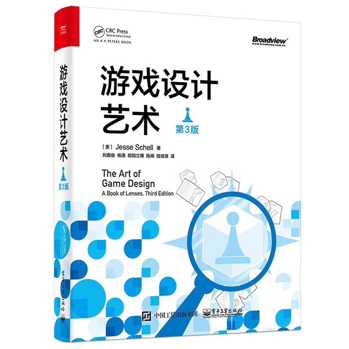

====================
游戏设计知识来源清单
====================

.. note::
   最后更新：2025年9月14日

《游戏设计艺术》
==============================

**Schell独创的"透镜卡片"系统**

每个透镜都有对应的实体卡片，卡片背面印有4-6个具体问题。设计时抽取相关卡片，逐一回答问题，例如：

- **透镜#31：挑战透镜** 
  - "玩家面临什么挑战？"
  - "这些挑战与玩家技能匹配吗？"
  - "挑战是否随时间增长？"
  - "玩家能清楚看到下一个挑战吗？"

- **透镜#52：经济透镜**
  - "游戏中什么是稀缺的？什么是丰富的？"
  - "玩家想要什么？需要什么来得到它？"
  - "哪些资源可以转换？汇率如何？"

**Schell的"四要素"诊断法：**

遇到设计问题时，按顺序检查：机制→故事→美学→技术。

《游戏设计的236个技巧》
=======================

.. image:: static/image2.jpg
   :alt: 游戏设计的236个技巧封面
   :target: https://zh.z-library.sk/s/游戏设计的236个技巧：游戏机制、关卡设计和镜头窍门
   :width: 200px
   :align: center

**编号索引式问题解决手册**

每个技巧都有固定编号和三段式结构：问题描述→解决方案→实施细节，例如：

- **技巧#089："教学岛屿"**
  - 问题：玩家在复杂环境中无法专注学习新机制
  - 方案：创建隔离的小区域，只包含待学习元素
  - 实施：《超级马里奥64》的城堡庭院，《塞尔达》的初始台地

- **技巧#156："能力门槛"**
  - 问题：如何确保玩家掌握技能后才能继续
  - 方案：设置只能用特定技能通过的关卡段落
  - 实施：《银河战士》的炸弹跳跃门，《恶魔城》的二段跳平台

配合食用
================

**"透镜+技巧"双重验证：**

1. 用Schell透镜发现设计盲点（如透镜#31发现挑战不匹配）
2. 在236技巧中找对应编号解决（如技巧#078-089学习曲线组）
3. 用相关透镜验证解决方案（如透镜#52检查经济平衡）

**实战工作流：**

- **卡住时：** 抽透镜卡片，从不同角度重新审视问题
- **有方向时：** 直接查236技巧的对应编号段落
- **验收时：** 用Schell的四要素诊断法做最终检查

关于
----------------

:作者: Refactor团队

:主要贡献者 (按姓氏拼音排序):
    * 邱文涛

:特别鸣谢: 所有走在前列、为后辈探路的游戏开发行业的师兄师姐们。